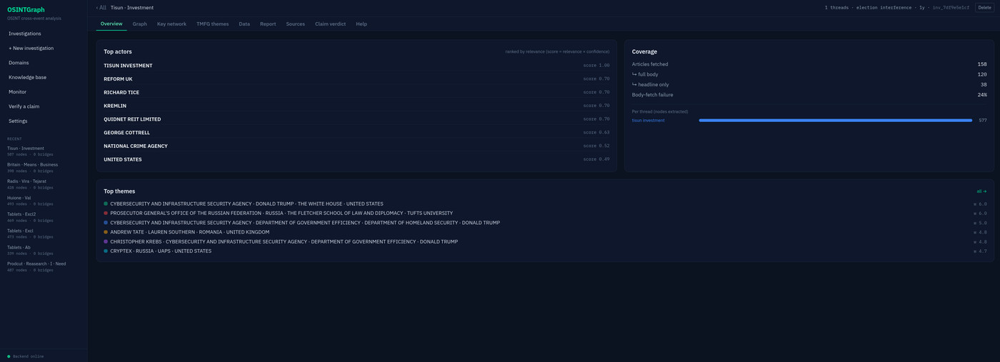
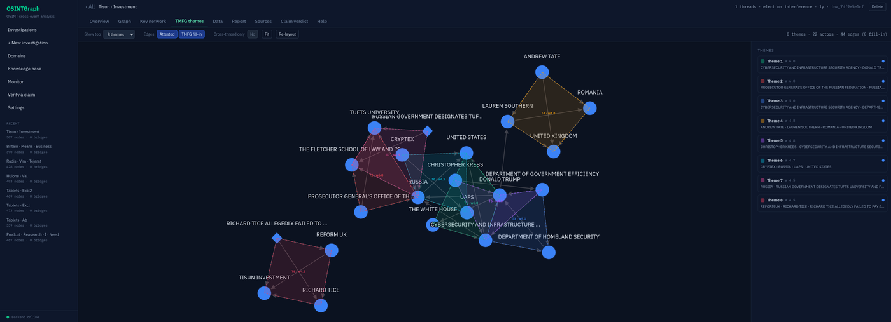
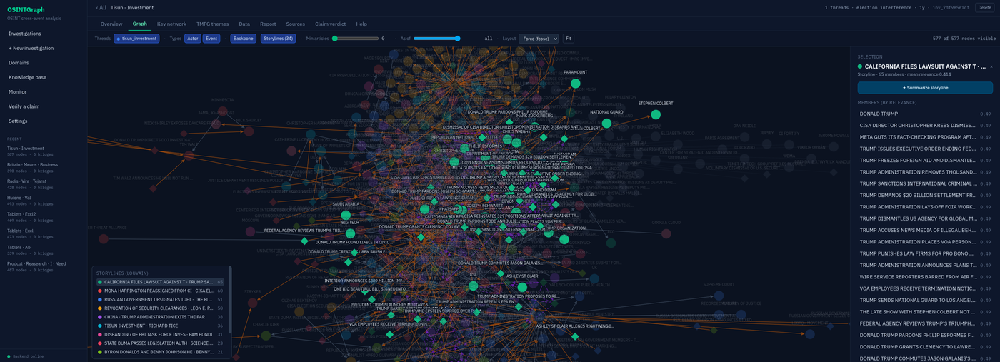
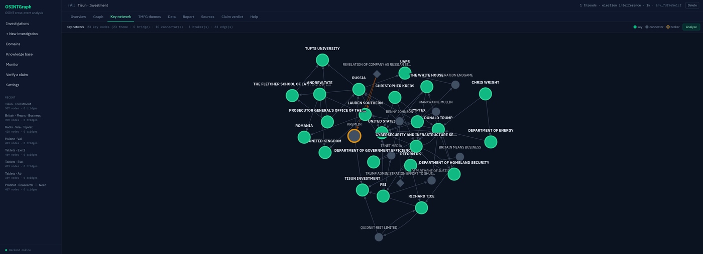
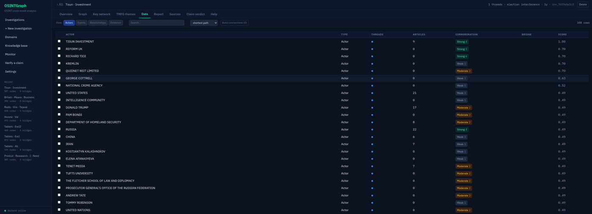
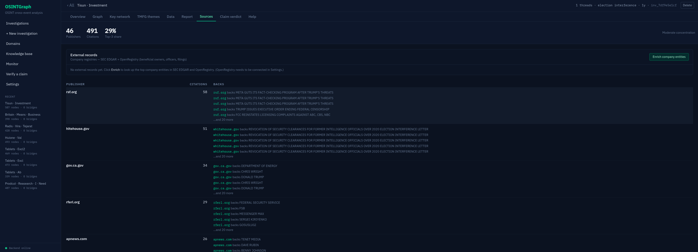

# Investigator — finding the hidden threads in news

**Investigator** is an OSINT analysis pipeline that reads a corpus of news
articles about several separate stories and surfaces the **actors, events, and
relationships that connect them** — the cross-story structure a human analyst
would otherwise have to find by reading hundreds of articles by hand.

It turns a bag of source material into a **scored knowledge graph**, detects the
**themes** (tight clusters of actors that recur together) and the **bridges**
(actors that appear in more than one story), and produces an analyst-grade
report in which **every claim is traced back to a source URL**.



An investigation's **Overview**: top actors ranked by relevance × confidence,
corpus coverage, and the top evidence-weighted themes — one tab among Graph /
Key network / TMFG themes / Data / Report / Sources / Claim verdict.

---

## The problem

An investigator following a region or a topic juggles many parallel stories at
once. The interesting finding is rarely inside one story — it's the **actor who
shows up in two of them**: the financier named in a sanctions story who also
appears in a separate shipping story; the same intermediary in two unrelated
indictments. Finding those links means holding hundreds of articles in your head
and noticing the one name that crosses over.

Investigator does that crossover detection mechanically.


Three independent news searches. The two green-bordered nodes —
**HAMAS** and **IRAN** — are *bridges*: actors the system found attested in more
than one story. Two stories apart, but the same actor.

---

## How it works


The pipeline runs in six stages. The first two are extraction; the next three
turn a soup of per-article facts into a structured network; the last lets a
confidence calculation propagate across it.

1. **Fetch.** Search Google News for each query and download the most relevant
   articles. Bodies that fail to fetch (paywalls, blocks) are kept as
   **headline-only** records rather than dropped — a headline still carries
   entity signal. Beyond news you can enable **additional search sources**
   (Wikipedia, GDELT, OpenSanctions, generic web search — see below), and bring
   your **own sources** — upload PDFs or paste URLs — analysed alongside the
   fetch, or on their own (`--no-gnews`) to run the same graph machinery over a
   single case file or document.
2. **Extract.** An LLM reads each article and pulls out the **named actors**
   (people, organisations, places) and the **events** (concrete incidents:
   who did what to whom, when, where), plus any **source-claimed causation**.
3. **Merge evidence across articles.** Surface variants of the same actor
   ("Vladimir Putin" / "Putin" / "the Russian president") collapse into one
   node, and the union of articles that mention it becomes that node's
   **evidence list**. Relationships merge the same way — three articles
   asserting the same link become one edge of weight three carrying three URLs.
4. **Filter to the backbone.** Rank relationships by how many independent
   articles attest them, drop the singletons, but restore the **shortest path**
   from any orphaned actor back to the investigation subject so nothing relevant
   gets cut off.
5. **Triangulate (TMFG).** Build a chordal-planar **Triangulated Maximally
   Filtered Graph**. It decomposes into a tree of 4-cliques; each 4-clique is a
   **theme**. Edges TMFG adds that weren't directly attested become the system's
   **structural hypotheses**, kept distinct from facts.
6. **Confidence propagation.** A junction-tree belief-propagation pass over the
   clique tree adjusts each actor's confidence by the company it keeps — exact,
   because the graph is chordal.

For **cross-story analysis**, every query is fed into one session of the same
pipeline, and every node/edge is stamped with which query produced it. Actors
that appear in more than one query's data are the **bridges**.

A full diagram of the data flow is in [`docs/pipeline.md`](docs/pipeline.md). All
documentation lives under [`docs/`](docs/README.md).

---

## Themes you can interrogate

A *theme* is the system's answer to "which actors belong together?" — a tight
group of four that keep co-occurring. Themes are ranked by an **evidence-weighted
score**, so the top theme is the best-*corroborated* cross-story structure, not
merely the densest one. (Switching from connectivity-ranking to evidence-ranking
moved the top themes of a real three-story run from a roughly even actor/event
mix to ~90% actor-centred — surfacing the relationship structures an
investigator wants and pushing duplicate event-headlines down.)


The TMFG backbone with its top 4-clique themes shaded as polygons. Solid edges
are corroborated by a source; dashed edges are the structural **fill-in** the
algorithm adds — hypotheses to verify. Bridges sit where polygons intersect.

A theme isn't a dead-end label. Open one and it expands into the **relationships
binding its four members**, each with its source. A real example, from a
sanctions-evasion run:

> **Theme: CHINA · CIPS · IRAN · RUSSIA** — *evidence-weighted score 5.9*
> - **CHINA** ↔ **CIPS** *(ownership)*: "China operates and controls the
>   Cross-Border Interbank Payment System (CIPS), used to facilitate
>   yuan-denominated transactions… amid sanctions." `[cnbc.com]`
> - **CIPS** ↔ **RUSSIA** *(non-direct)*: "CIPS has seen increased usage by
>   Russian entities… following Western sanctions." `[…]`
> - **CIPS** ↔ **IRAN** *(non-direct)*: "CIPS volumes reached record highs in
>   global oil trade involving Iran." `[…]`

The theme names the *mechanism* (CIPS, China's yuan payment rail) binding the
sanctions network — not just four co-occurring names.



The TMFG-themes tab on a live election-interference run: each shaded polygon is
one 4-clique theme, ranked by evidence weight in the side panel.

---

## Storylines: seeing the graph as narratives

Themes are deliberately fine-grained (4 actors each). **Storylines** are the
coarse layer above them: seeded **Louvain community detection** over the
corroboration-weighted relationship graph splits an investigation into its
structurally cohesive narrative clusters — typically 10–30 per run, each a
story an analyst instantly recognises ("the FinCEN rulemaking", "the Upbit
hack", "the Prince Group sanctions").



On the **Graph** tab, toggle **Storylines** to colour nodes by community, pick
one from the legend (or jump from any node via its *Storyline* link) and the
graph focuses on it. The side panel lists its members by relevance, and
**Summarize storyline** has the LLM narrate that cluster as one story —
what happened, the key actors, a dated timeline, and — crucially — whether the
storyline actually **bears on the investigation's hypothesis** or is peripheral
noise.

That last point is the reason this layer exists: validation on real runs showed
off-topic clusters (an astronomy story inside a product-research corpus) score
*average* per-entity relevance — indistinguishable node by node — while being
perfectly separated *structurally*. Community structure catches what
per-entity scoring can't.

---

## A worked example: Iran's proxy network

Three independent searches from one run — an Israeli strike on a Hamas leader,
US Treasury sanctions on Hezbollah financiers, and Houthi Red-Sea attacks —
fuse into one graph:


The actual merged graph the system built. Each story is one colour; the two
green bridges (**HAMAS**, **IRAN**) connect them. The thick red edge is a
**source-claimed causation** the analysis preserved verbatim.

### What an investigator gets

For each bridge, a small dossier they can verify: the articles in each story that
mention it, the **actual quotes** (with URL) extracted as evidence, and the
structural reason the system flagged it. And ranked cross-story **leads** like:

> **BINANCE** (sanctions story) ↔ **HOUTHI** (Red-Sea story) *via bridge* **IRAN**
>
> Grounded in a source-cited relation on the Binance node:
> *"Iran funneled \$850 million through Binance… used as a channel for Iranian
> financial transactions."* — `newsmax.com`

That's a defensible analyst lead — not "Binance is helping the Houthis" (no
article says that), but "Iran's financial channels through Binance overlap with
the same Iran that operates the Houthis. Worth examining together."


The compression that makes the lead findable: 449 fetched articles distilled to
57 scored graph nodes, 2 cross-story bridges, and 8 ranked leads.

---

## Search sources you can enable

Google News is the default, but each investigation can pull from additional
sources, toggled per-source in the New-Investigation **Sources** step (and via
repeatable `--source` on the CLI). They fetch text about the subject and flow
through the identical extract → graph pipeline. A source that fails or isn't
configured is skipped — it never breaks a run.

| Source | Key needed | What it adds |
|---|---|---|
| **Wikipedia** | no | Encyclopedic article text about the subject (MediaWiki API). |
| **GDELT** | no | Global news coverage, broader than Google News (free tier is rate-limited). |
| **OpenSanctions** | yes (`INVESTIGATOR_OPENSANCTIONS_KEY`) | Sanctions / PEP / watchlist entries; shows as *needs key* until set. |
| **Web search** | no* | Generic web results — Google Programmable Search if `INVESTIGATOR_GOOGLE_API_KEY`+`INVESTIGATOR_GOOGLE_CSE_ID` are set, else DuckDuckGo. |

---

## Connecting the dots: hidden relationships between entities

The whole graph can be dense. When you want to ask a focused question — *how are
**these** specific actors/events related?* — select any set of them in the
**Data** tab and build a **Connections** subgraph on demand. Three modes:

- **Shortest path** — the single thinnest route between each selected pair, plus
  the intermediary ("connector") entities it passes through.
- **Hidden (indirect)** — the interesting one. It finds the *non-obvious*
  multi-hop chains (up to *k* distinct shortest paths per pair), so links that
  run through intermediaries surface **even when a direct edge already exists**.
  Intermediaries are ranked by **betweenness** and the central ones flagged as
  **brokers** — the entities that actually bind the selection together.
- **Direct only** — just the edges that exist directly among the selection.

Pathfinding runs on the *relationship* edges only (the evidence-to-root scaffold
is excluded, so connections aren't faked through the hub).

> **Example (Netanyahu corruption run).** Select **Arnon Milchan** and **Shaul
> Elovitch**. *Shortest path* shows only the obvious
> `Milchan → Netanyahu → Elovitch`. *Hidden* mode also surfaces
> `… → Bezeq → Elovitch` and `… → Walla! News → Elovitch` — the actual Case-4000
> entities — and flags **Netanyahu** as the broker. The indirect structure a
> shortest path hides.

Hit **Analyse** and the connected subgraph — actors, events, relationships, and
the computed paths — is sent to the LLM, which writes a short, evidence-grounded
report on *how* the selected entities interconnect (naming each chain and what
each broker bridges).

### Key network — the automatic version

The **Key network** tab does this with no manual selection: it seeds the
hidden-connections algorithm with the investigation's *most-relevant* nodes —
the **theme members** (the evidence-weighted TMFG clusters) plus the **bridges**
(cross-investigation actors) — and surfaces the **broker** entities that stitch
those otherwise-separate themes into one skeleton. It's the connective tissue the
themes view doesn't show: on the Netanyahu run the 21 theme nodes resolve to a
single broker, the **Attorney-General's Office**, binding the clusters. One
**Analyse** click then summarises the whole investigation's structure. (Quality
tracks the upstream themes/bridges — a thin run yields a thin skeleton.)



The key-network skeleton of a live run: green **key** nodes (theme members and
bridges), grey **connectors**, and the amber-ringed **broker** the paths run
through.

---

## Fact-checking: how many sources agree

Corroboration — the core of fact-checking — is surfaced throughout the UI at two
levels:

- **Claim-level badges** on every actor and every piece of evidence (Data tab):
  **weak** (1 source), **moderate** (2), **strong** (3+) — by how many
  *independent* sources confirm the **same claim**. Claims are clustered by
  meaning (paraphrases count together), and near-identical **syndicated** copies
  collapse to one source — so a wire story reprinted by 20 outlets is *not*
  mistaken for 20 confirmations.
- **Confidence boost** in the scoring: an entity attested by more independent
  sources is pushed further from neutral, so well-corroborated actors rank above
  single-source ones (a single source still counts, just less).



The **Data** tab: every actor with its per-claim corroboration tier, article
count, and relevance score — and the selection checkboxes that feed the
on-demand Connections analysis.

The **Sources** tab shows the other half of source criticism: publisher
concentration (how much of the corpus hangs on the top-3 outlets), each
publisher's claims, and one-click **entity enrichment** against external
company registries (SEC EDGAR + OpenRegistry — see below).



---

## Claim-driven investigations: from a claim to an ICD-203 verdict

Instead of a search query, you can hand the system a **claim** ("Huawei supplies
Iran with surveillance technology used to suppress protests") and get back a
**confidence verdict** with the evidence for *and against*. Two depths:

- **Quick check** (*Verify a claim* page, ~30 s). The claim is normalised to a
  testable assertion, expanded into **balanced supporting and refuting
  searches**, and each retrieved snippet is stance-classified. The result is an
  ICD-203 verdict (*Almost Certainly … Almost Certainly Not*) with the
  supporting/refuting evidence cards, the queries actually run (adversarial
  transparency), and **source-count tempering** — a thin evidence base pulls
  the verdict toward the middle and is flagged as a lead, not a conclusion.
- **Full claim investigation** (one click from the quick check, or seed the
  New-Investigation wizard from a claim). The claim's support/refute searches
  become the investigation's **event threads** — so the graph is built on
  both-sides evidence by design — and the normalised assertion becomes the
  relevance hypothesis. The **adversarial fan-out** is configurable (3+3
  threads for a thorough run, 1+1 fast, or a single neutral thread), as are the
  per-thread depth knobs; each thread costs roughly one single-query run. In
  the wizard the planned threads are fully editable before launch, and claim
  mode can be switched off while keeping the threads.

When a claim investigation finishes, the **Claim verdict** tab stance-classifies
the *deep* graph evidence (not a fresh search) against the stored claim and
aggregates it into the same ICD-203 verdict — on a validation run it reached
**Almost Certainly** from 11 independent sources including primary FinCEN /
Federal Register documents, with a genuine 22-support / 1-refute / 37-neutral
stance split rather than a rubber stamp. The tab also works on any older
investigation: type a claim and it is assessed against that graph's evidence.

---

## A cumulative knowledge graph across investigations (optional)

With the analytics engine enabled (`--analytic_engine_enabled`), each finished
investigation's graph accumulates into **one persistent knowledge graph**
(in-code LightRAG, no separate server) stored outside the code tree at
`~/.local/share/investigator/kg` (override with `INVESTIGATOR_KG_STORE`). Later
investigations can draw on what earlier ones found.

- **Cross-investigation canonicalization.** A conservative layer keeps the same
  real-world entity from fragmenting across runs — it auto-merges only safe name
  variants (exact + formatting) and routes fuzzy matches to a review log rather
  than risking a wrong, permanent merge.
- **Nothing is lost.** LightRAG's graph keeps only a fixed schema, so a sidecar
  **structured store** preserves every property we build — belief scores,
  evidence (with confidence + source URLs), labels, themes, per-edge relation
  type/context, hypothesis flags, and which investigations attested each item —
  keyed by the same canonical names and merged across runs.
- **Query it from the UI.** The **Knowledge Base** tab asks questions across
  *everything* seen in all investigations: it returns the structured entities
  and relationships (entity-anchored *hybrid* retrieval) plus an optional
  LLM-synthesised answer, and each entity expands to show its belief score,
  corroborating evidence, source links, and the investigations it appears in.
- **Pre-seeding.** When a new investigation starts it is pre-seeded with what the
  KG already knows about its subject, surfaced alongside the fresh findings.

### The standing monitor

Built on the cumulative KG, the **Monitor** tab turns Investigator from
request-driven into a *standing watch*: a scheduled job fetches fresh news for a
watchlist, keeps only events touching entities the KG already knows, and
propagates **impact** onto connected nodes (a small local TMFG + belief
propagation around each touched entity) — producing a ranked, dated digest of
*what moved in your graph*. Read-only over the KG. Details in
[`docs/monitoring.md`](docs/monitoring.md).

---

## What this is NOT

- **Not a causation engine.** It surfaces co-occurrence and source-attested
  relationships. Causation appears only where a source article itself asserts it.
- **Not comprehensive.** The graph is only as good as the news corpus.
- **Not a final answer.** A cross-story lead is a place to start reading — the
  system gives you the URLs precisely because someone still has to read them.

---

## Architecture

Three processes:

```
 ┌────────────────────┐   spawns    ┌──────────────────────┐   HTTP POST   ┌─────────────────────┐
 │  Frontend (Svelte) │  /api proxy │  UI backend (Flask)  │ ───────────▶  │  Pipeline engine     │
 │  Vite dev :5180    │ ──────────▶ │  ui/server  │               │  python -m investigator  │
 │  graph / themes /  │             │  :5050  REST + SSE   │ ◀───────────  │  :5003               │
 │  data / report UI  │ ◀────────── │  job queue + reports │   graph JSON  │  NER · graph · TMFG  │
 └────────────────────┘             └──────────────────────┘               │  · belief propagation│
                                                                            └─────────────────────┘
```

- **Pipeline engine** (`python -m investigator`, port **5003**) — the core: entity +
  event extraction (dspy + GPT-4.1), evidence consolidation, graph build, the
  corroboration filter, TMFG triangulation, and junction-tree belief propagation.
- **UI backend** (`ui/server.py`, port **5050**) — REST + SSE API
  (see [`docs/ui-api.md`](docs/ui-api.md)). Runs investigations as subprocesses
  that POST to the engine, streams progress, generates customer reports, and
  serves the Cytoscape-ready graph/theme payloads.
- **Frontend** (`ui/`, Svelte 5 + Vite, port **5180**) — the investigator UI:
  New-Investigation wizard (domain-aware query refinement + a vetoable review
  step, optional **claim seeding** into editable support/refute threads, plus a
  Sources step for adding your own PDFs/URLs), live progress, the Graph /
  Key-network / TMFG-themes / Data / Report / Sources / **Claim-verdict** tabs,
  **Storylines** (Louvain communities with per-community LLM narration),
  on-demand **Connections** analysis (select entities → hidden-relationship
  subgraph + LLM summary), an automatic **Key network** (theme+bridge skeleton
  with brokers), per-actor/per-evidence **corroboration** badges, a
  **Verify a claim** quick check, a **Knowledge Base** tab (query the cumulative
  cross-investigation KG), a **Monitor** tab (standing watch digests), and a
  **Settings** page for connecting data providers.

---

## Running it

The fastest path is Docker; a manual setup is right below it. Either way you'll
need an **OpenAI API key**.

### Quick start with Docker

Runs all three services (engine, UI backend, frontend) in one container.

```sh
cp .env.example .env          # then edit .env and set OPENAI_API_KEY
docker compose up --build     # reads OPENAI_API_KEY from your shell or .env
```

Or without compose:

```sh
docker build -t investigator .
docker run --rm -p 5003:5003 -p 5050:5050 -p 5180:5180 \
  -e OPENAI_API_KEY=sk-... -v investigator-data:/data investigator
```

Then open **http://localhost:5180**. Durable session state and the cumulative
knowledge graph persist in the `investigator-data` volume.

### Manual setup

**Prerequisites:** Python **3.12** (3.11+ works), **Node.js 18+**, and an
**OpenAI API key**.

**1. Install.** A virtualenv keeps the heavy ML stack isolated; `pip install -e .`
pulls the full pipeline from `pyproject.toml` (the one source of truth for deps):

```sh
python -m venv .venv && source .venv/bin/activate
pip install -e .
```

**2. Secrets.** Copy the template and fill in your key (the real `.env` is
git-ignored):

```sh
cp .env.example .env
# edit .env and set OPENAI_API_KEY
```

**3. Start the pipeline engine (port 5003):**

```sh
INVESTIGATOR_TMFG=1 INVESTIGATOR_VIZ=1 INVESTIGATOR_DISABLE_CACHE=1 \
  PYTHONPATH=src:. python -m investigator
```

`INVESTIGATOR_TMFG=1` enables the theme/network-analysis stages. Add
`--analytic_engine_enabled` (or set `ANALYTIC_ENGINE_ENABLED=1`) to accumulate
finished investigations into the cumulative knowledge graph (so the
**Knowledge Base** tab has data). If the Knowledge Base stops picking up new
investigations, this switch is the first thing to check — the engine runs fine
without it and won't warn you.

**4. Start the UI backend (port 5050):**

```sh
PYTHONPATH=.:src python ui/server.py --port 5050
```

It auto-discovers past investigation artifacts under
`news_investigations/cross_event/`. Add `--host 0.0.0.0` to reach it from another
machine on the LAN (the Vite dev server already binds all interfaces).

**5. Start the frontend (port 5180):**

```sh
cd ui && npm install && npm run dev   # http://localhost:5180, proxies /api -> :5050
```

Open **http://localhost:5180**.

### Useful environment variables

| Variable | Effect |
|---|---|
| `OPENAI_API_KEY` | LLM access (engine, and the UI's query-refinement endpoint). |
| `ANALYTIC_ENGINE_ENABLED=1` | Accumulate finished investigations into the cumulative KG (same as `--analytic_engine_enabled`). |
| `INVESTIGATOR_TMFG=1` | Enable TMFG themes + belief propagation (required for the themes tab). |
| `INVESTIGATOR_DISABLE_CACHE=1` | Disable the LLM response cache. |
| `INVESTIGATOR_TMFG_UNIFORM_WEIGHTS=1` | Restore the old topology-only theme weighting (default is evidence-aware). |
| `INVESTIGATOR_UI_MAX_CONCURRENT` | Max concurrent investigations the UI backend runs (default 1). |
| `INVESTIGATOR_CORRO_GAIN` / `INVESTIGATOR_CORRO_CAP` | Multi-source corroboration confidence boost (default gain 0.35, cap 8). |
| `INVESTIGATOR_CLAIM_SIM` / `INVESTIGATOR_SYNDICATION_SIM` | Claim-clustering / syndication thresholds for the fact-checking badges (default 0.78 / 0.97). |
| `INVESTIGATOR_KG_LLM_MODEL` | OpenAI model for the cumulative-KG layer (default `gpt-4.1-mini`). |
| `INVESTIGATOR_KG_STORE` | Cumulative-KG store directory (default `~/.local/share/investigator/kg`). |
| `INVESTIGATOR_OPENSANCTIONS_KEY` | API key enabling the OpenSanctions search source. |
| `INVESTIGATOR_GOOGLE_API_KEY` / `INVESTIGATOR_GOOGLE_CSE_ID` | Google Programmable Search for the web-search source (else DuckDuckGo). |

---

## Running an investigation from the CLI (no UI)

```sh
PYTHONPATH=.:src python research/cross_event_investigation.py \
  --domain sanctions_evasion --period 30d \
  --event "russia_oil:Russia oil sanctions evasion dark fleet 2026" \
  --event "china_yuan:China yuan settlement Russia trade sanctions 2026" \
  --event "iran_drone:Iran Russia military cooperation drone supply 2026"
```

Add extra search sources with repeatable `--source` (e.g.
`--source wikipedia --source gdelt --source websearch`).

Then turn the artifact into a customer report:

```sh
python research/build_customer_report.py news_investigations/cross_event/<artifact>.json
```

### Analysing your own documents

Add PDFs or URLs as extra sources, with or without a news fetch. With
`--no-gnews` the pipeline runs purely over what you supply — e.g. a single case
file under the `criminal_investigation` domain:

```sh
PYTHONPATH=.:src python research/cross_event_investigation.py \
  --domain criminal_investigation --no-gnews \
  --event "case:GBH stabbing investigation" \
  --extra-pdf /path/to/report.pdf --extra-url https://example.com/filing
```

---

## Enriching entities (optional)

After a run, `research/enrichment.py` can attach external records to the top
company (`ORG`) entities in the graph — written to `<artifact>.enriched.json`
and surfaced in the customer report under each entity as **External records**.
It's opt-in and decoupled from the engine (it makes network calls).

```sh
PYTHONPATH=.:src python research/enrichment.py <artifact.json> [--top-n 12]
```

Two free providers:

- **SEC EDGAR** — works out of the box, no key. US public-company identity +
  recent filings.
- **OpenRegistry** — 30 national company registries (beneficial owners,
  officers, shareholders). Free tier, and crucially **no account and no API
  key**: auth is OAuth 2.1 with Dynamic Client Registration. Authorise **once**:

  ```sh
  PYTHONPATH=.:src python research/enrichment.py --openregistry-login
  ```

  This opens OpenRegistry's authorisation page in your browser — you just click
  **Authorize** (there is *no* username/password; optionally enter an email to
  raise the free limit from 20→30 rpm). The tokens (incl. a refresh token) are
  stored at `~/.config/investigator/openregistry_oauth.json` and **auto-refresh**
  thereafter, so you only do this once. On a headless server, run the login on a
  machine with a browser and copy that file over (or point `INVESTIGATOR_OAUTH_DIR`
  at it).

  You can also do this **without the CLI**, from the app: **Settings →
  OpenRegistry → Connect**, which runs the same one-time browser authorisation
  and shows live connection status. *Tip:* do the **Authorise** step in
  **Firefox** — Chrome/Edge/Brave block the provider's redirect back to
  `localhost`, so the login can't complete there (the Settings page also offers
  a paste-the-callback-URL fallback).

Disable a provider with `--no-edgar` / `--no-openregistry`. Note: enrichment
sends extracted entity *names* to these external services. You can also run
enrichment **from the app** — the **Sources** tab has an *Enrich* button that
runs the same lookup and lists each entity's external records.

---

## Repository layout

```
src/investigator/            Pipeline engine: NER, graph build, dedup/merge,
                         corroboration filter, TMFG, junction-tree BP.
  graph/connector.py         Connections subgraph (shortest-path / hidden / brokers)
  graph/corroboration.py     Claim-level multi-source corroboration (fact-check badges)
  analytics/                 Cumulative KG: in-code LightRAG merge, cross-
                             investigation canonicalization, structured_store
                             (preserves all node/edge props), retrieval
  monitor/                   Standing watch: watchlist intake, KG intersect,
                             impact propagation, ranked digests
research/
  cross_event_investigation.py   CLI driver for a multi-query run
  claim_verify.py                Claim → assertion + adversarial search plan +
                                 stance classification + ICD-203 verdict
  search_sources.py              Wikipedia / GDELT / OpenSanctions / web providers
  enhanced_retrieval.py          Query-expansion + rerank + entity-deepening
  build_customer_report.py       Analyst-grade markdown report generator
  build_graph_prototype.py       Cytoscape graph-payload (incl. Louvain
                                 storyline layer) + standalone prototype
  build_tmfg_prototype.py        TMFG-themes payload + standalone prototype
  build_full_ui_prototype.py     Single-file six-tab UI prototype
  build_blog_post.py             Generates the illustrated blog post
  domain_presets.py              Per-domain relevance hypotheses
ui/                      Svelte 5 + Vite frontend (the investigator UI)
  server.py              UI backend (REST + SSE) — see docs/ui-api.md
docs/                    All project documentation (see docs/README.md)
  architecture.md        System overview · components · data stores
  pipeline.md            Graph-creation pipeline (per-investigation)
  knowledge-base.md      Cumulative KG · temporal layer · retrieval
  analysis.md            Themes · bridges · belief propagation
  sources.md             Search sources + enrichment
  operations.md          Running, env vars, OOM/memory notes
  data-model.md          Node/edge schema + structured sidecar
  ui-api.md              REST + SSE contract
  roadmap.md             Productization roadmap
  monitoring.md          Standing monitor (watchlist · impact digests)
  reviews/               Design reviews
  images/                README figures
  screenshots/           UI screenshots used in this README
news_investigations/     Run artifacts + job state (git-ignored)
```

---

## Method notes

- **Confidence language** in reports follows ICD-203 analytic standards
  (Almost Certain / Highly Likely / Likely / …).
- **Themes** are ranked by an evidence-weighted score (attested actor-to-actor
  links and cross-run corroboration count for more than incidental co-mentions).
- **No closed sources, no human-intelligence, no open-web crawling** beyond the
  publisher pages the news aggregator returns.

This is research-grade software. Numbers in the examples are exact counts from
specific runs; different runs on the same queries may differ due to LLM
non-determinism and news-corpus drift.
