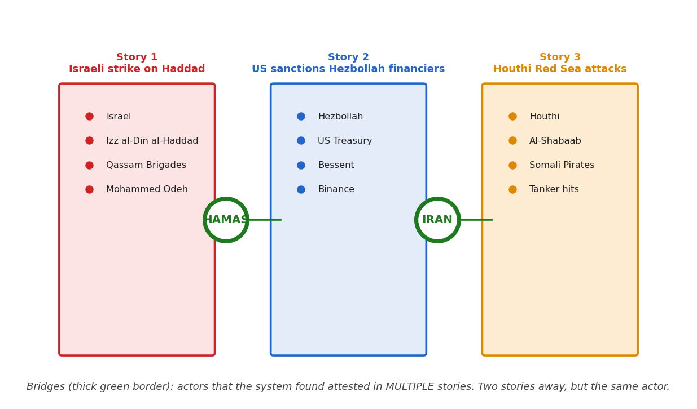
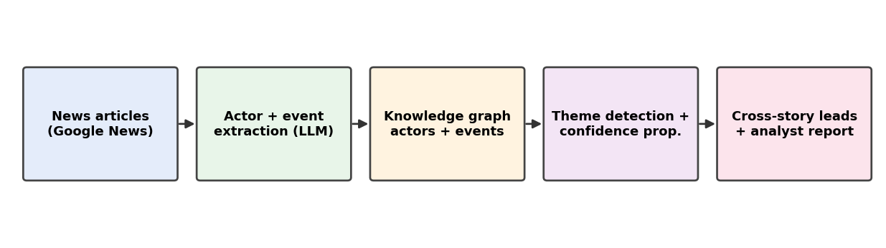
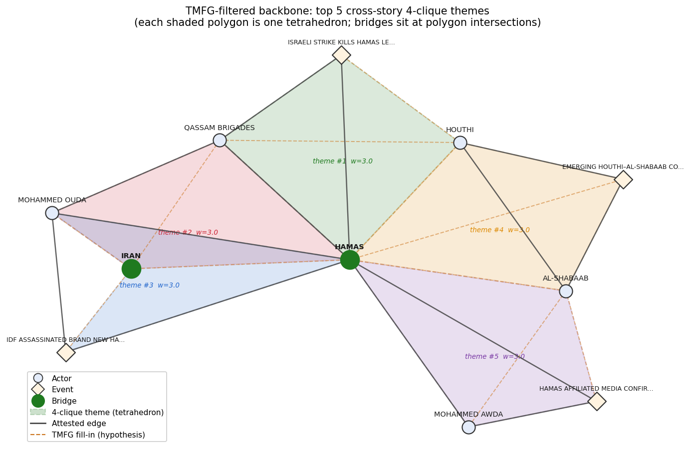
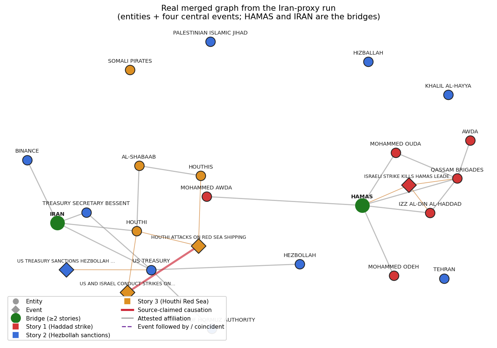

# Investigator — finding the hidden threads in news

**Investigator** is an OSINT analysis pipeline that reads a corpus of news
articles about several separate stories and surfaces the **actors, events, and
relationships that connect them** — the cross-story structure a human analyst
would otherwise have to find by reading hundreds of articles by hand.

It turns a bag of source material into a **scored knowledge graph**, detects the
**themes** (tight clusters of actors that recur together) and the **bridges**
(actors that appear in more than one story), and produces an analyst-grade
report in which **every claim is traced back to a source URL**.

---

## The problem

An investigator following a region or a topic juggles many parallel stories at
once. The interesting finding is rarely inside one story — it's the **actor who
shows up in two of them**: the financier named in a sanctions story who also
appears in a separate shipping story; the same intermediary in two unrelated
indictments. Finding those links means holding hundreds of articles in your head
and noticing the one name that crosses over.

Investigator does that crossover detection mechanically.



Three independent news searches. The two green-bordered nodes —
**HAMAS** and **IRAN** — are *bridges*: actors the system found attested in more
than one story. Two stories apart, but the same actor.

---

## How it works



The pipeline runs in six stages. The first two are extraction; the next three
turn a soup of per-article facts into a structured network; the last lets a
confidence calculation propagate across it.

1. **Fetch.** Search Google News for each query and download the most relevant
   articles. Bodies that fail to fetch (paywalls, blocks) are kept as
   **headline-only** records rather than dropped — a headline still carries
   entity signal. You can also bring your **own sources** — upload PDFs or paste
   URLs — analysed alongside the news fetch, or on their own (`--no-gnews`) to
   run the same graph machinery over a single case file or document.
2. **Extract.** An LLM reads each article and pulls out the **named actors**
   (people, organisations, places) and the **events** (concrete incidents:
   who did what to whom, when, where), plus any **source-claimed causation**.
3. **Merge evidence across articles.** Surface variants of the same actor
   ("Vladimir Putin" / "Putin" / "the Russian president") collapse into one
   node, and the union of articles that mention it becomes that node's
   **evidence list**. Relationships merge the same way — three articles
   asserting the same link become one edge of weight three carrying three URLs.
4. **Filter to the backbone.** Rank relationships by how many independent
   articles attest them, drop the singletons, but restore the **shortest path**
   from any orphaned actor back to the investigation subject so nothing relevant
   gets cut off.
5. **Triangulate (TMFG).** Build a chordal-planar **Triangulated Maximally
   Filtered Graph**. It decomposes into a tree of 4-cliques; each 4-clique is a
   **theme**. Edges TMFG adds that weren't directly attested become the system's
   **structural hypotheses**, kept distinct from facts.
6. **Confidence propagation.** A junction-tree belief-propagation pass over the
   clique tree adjusts each actor's confidence by the company it keeps — exact,
   because the graph is chordal.

For **cross-story analysis**, every query is fed into one session of the same
pipeline, and every node/edge is stamped with which query produced it. Actors
that appear in more than one query's data are the **bridges**.

A full diagram of the data flow is in [`FLOW.md`](FLOW.md).

---

## Themes you can interrogate

A *theme* is the system's answer to "which actors belong together?" — a tight
group of four that keep co-occurring. Themes are ranked by an **evidence-weighted
score**, so the top theme is the best-*corroborated* cross-story structure, not
merely the densest one. (Switching from connectivity-ranking to evidence-ranking
moved the top themes of a real three-story run from a roughly even actor/event
mix to ~90% actor-centred — surfacing the relationship structures an
investigator wants and pushing duplicate event-headlines down.)



The TMFG backbone with its top 4-clique themes shaded as polygons. Solid edges
are corroborated by a source; dashed edges are the structural **fill-in** the
algorithm adds — hypotheses to verify. Bridges sit where polygons intersect.

A theme isn't a dead-end label. Open one and it expands into the **relationships
binding its four members**, each with its source. A real example, from a
sanctions-evasion run:

> **Theme: CHINA · CIPS · IRAN · RUSSIA** — *evidence-weighted score 5.9*
> - **CHINA** ↔ **CIPS** *(ownership)*: "China operates and controls the
>   Cross-Border Interbank Payment System (CIPS), used to facilitate
>   yuan-denominated transactions… amid sanctions." `[cnbc.com]`
> - **CIPS** ↔ **RUSSIA** *(non-direct)*: "CIPS has seen increased usage by
>   Russian entities… following Western sanctions." `[…]`
> - **CIPS** ↔ **IRAN** *(non-direct)*: "CIPS volumes reached record highs in
>   global oil trade involving Iran." `[…]`

The theme names the *mechanism* (CIPS, China's yuan payment rail) binding the
sanctions network — not just four co-occurring names.

---

## A worked example: Iran's proxy network

Three independent searches from one run — an Israeli strike on a Hamas leader,
US Treasury sanctions on Hezbollah financiers, and Houthi Red-Sea attacks —
fuse into one graph:



The actual merged graph the system built. Each story is one colour; the two
green bridges (**HAMAS**, **IRAN**) connect them. The thick red edge is a
**source-claimed causation** the analysis preserved verbatim.

### What an investigator gets

For each bridge, a small dossier they can verify: the articles in each story that
mention it, the **actual quotes** (with URL) extracted as evidence, and the
structural reason the system flagged it. And ranked cross-story **leads** like:

> **BINANCE** (sanctions story) ↔ **HOUTHI** (Red-Sea story) *via bridge* **IRAN**
>
> Grounded in a source-cited relation on the Binance node:
> *"Iran funneled \$850 million through Binance… used as a channel for Iranian
> financial transactions."* — `newsmax.com`

That's a defensible analyst lead — not "Binance is helping the Houthis" (no
article says that), but "Iran's financial channels through Binance overlap with
the same Iran that operates the Houthis. Worth examining together."

---

## What this is NOT

- **Not a causation engine.** It surfaces co-occurrence and source-attested
  relationships. Causation appears only where a source article itself asserts it.
- **Not comprehensive.** The graph is only as good as the news corpus.
- **Not a final answer.** A cross-story lead is a place to start reading — the
  system gives you the URLs precisely because someone still has to read them.

---

## Architecture

Three processes:

```
 ┌────────────────────┐   spawns    ┌──────────────────────┐   HTTP POST   ┌─────────────────────┐
 │  Frontend (Svelte) │  /api proxy │  UI backend (Flask)  │ ───────────▶  │  Pipeline engine     │
 │  Vite dev :5180    │ ──────────▶ │  ui/server  │               │  python -m investigator  │
 │  graph / themes /  │             │  :5050  REST + SSE   │ ◀───────────  │  :5003               │
 │  data / report UI  │ ◀────────── │  job queue + reports │   graph JSON  │  NER · graph · TMFG  │
 └────────────────────┘             └──────────────────────┘               │  · belief propagation│
                                                                            └─────────────────────┘
```

- **Pipeline engine** (`python -m investigator`, port **5003**) — the core: entity +
  event extraction (dspy + GPT-4.1), evidence consolidation, graph build, the
  corroboration filter, TMFG triangulation, and junction-tree belief propagation.
- **UI backend** (`ui/server.py`, port **5050**) — REST + SSE API
  (see [`docs/UI_API.md`](docs/UI_API.md)). Runs investigations as subprocesses
  that POST to the engine, streams progress, generates customer reports, and
  serves the Cytoscape-ready graph/theme payloads.
- **Frontend** (`ui/`, Svelte 5 + Vite, port **5180**) — the investigator UI:
  New-Investigation wizard (domain-aware query refinement + a vetoable review
  step, plus a Sources step for adding your own PDFs/URLs), live progress, and
  the Graph / TMFG-themes / Data / Report / Sources tabs.

---

## Running locally

### Prerequisites

- **Python** environment with the pipeline dependencies: `dspy`, `networkx`,
  `flask`, `python-dotenv`, `gnews`, `newspaper3k`, `googlenewsdecoder`,
  `semhash`, `wordllama`, `matplotlib`, `pymupdf`.
- The engine is **self-contained**: run it with `PYTHONPATH=src` (the package
  lives in `src/investigator`); no external sibling packages required.
- **Node.js** (18+) for the frontend.
- An **OpenAI API key**.

### 1. Secrets

Copy the template and fill in your key (the real `.env` is git-ignored):

```sh
cp .env.example .env
# edit .env and set OPENAI_API_KEY
```

### 2. Start the pipeline engine (port 5003)

```sh
INVESTIGATOR_TMFG=1 INVESTIGATOR_VIZ=1 INVESTIGATOR_DISABLE_CACHE=1 \
  PYTHONPATH=src:. \
  python -m investigator
```

`INVESTIGATOR_TMFG=1` enables the theme/network-analysis stages.

### 3. Start the UI backend (port 5050)

```sh
PYTHONPATH=.:src python ui/server.py --port 5050
```

It auto-discovers any past investigation artifacts under
`news_investigations/cross_event/` and exposes them via the API.

### 4. Start the frontend (port 5180)

```sh
cd ui
npm install
npm run dev          # serves http://localhost:5180, proxies /api -> :5050
```

Open **http://localhost:5180**.

### Useful environment variables

| Variable | Effect |
|---|---|
| `OPENAI_API_KEY` | LLM access (engine, and the UI's query-refinement endpoint). |
| `INVESTIGATOR_TMFG=1` | Enable TMFG themes + belief propagation (required for the themes tab). |
| `INVESTIGATOR_DISABLE_CACHE=1` | Disable the LLM response cache. |
| `INVESTIGATOR_TMFG_UNIFORM_WEIGHTS=1` | Restore the old topology-only theme weighting (default is evidence-aware). |
| `INVESTIGATOR_UI_MAX_CONCURRENT` | Max concurrent investigations the UI backend runs (default 1). |

---

## Running an investigation from the CLI (no UI)

```sh
PYTHONPATH=.:src python research/cross_event_investigation.py \
  --domain sanctions_evasion --period 30d \
  --event "russia_oil:Russia oil sanctions evasion dark fleet 2026" \
  --event "china_yuan:China yuan settlement Russia trade sanctions 2026" \
  --event "iran_drone:Iran Russia military cooperation drone supply 2026"
```

Then turn the artifact into a customer report:

```sh
python research/build_customer_report.py news_investigations/cross_event/<artifact>.json
```

### Analysing your own documents

Add PDFs or URLs as extra sources, with or without a news fetch. With
`--no-gnews` the pipeline runs purely over what you supply — e.g. a single case
file under the `criminal_investigation` domain:

```sh
PYTHONPATH=.:src python research/cross_event_investigation.py \
  --domain criminal_investigation --no-gnews \
  --event "case:GBH stabbing investigation" \
  --extra-pdf /path/to/report.pdf --extra-url https://example.com/filing
```

---

## Repository layout

```
src/investigator/            Pipeline engine: NER, graph build, dedup/merge,
                         corroboration filter, TMFG, junction-tree BP.
research/
  cross_event_investigation.py   CLI driver for a multi-query run
  enhanced_retrieval.py          Query-expansion + rerank + entity-deepening
  build_customer_report.py       Analyst-grade markdown report generator
  build_graph_prototype.py       Cytoscape graph-payload + standalone prototype
  build_tmfg_prototype.py        TMFG-themes payload + standalone prototype
  build_full_ui_prototype.py     Single-file six-tab UI prototype
  build_blog_post.py             Generates the illustrated blog post
  domain_presets.py              Per-domain relevance hypotheses
ui/                      Svelte 5 + Vite frontend (the investigator UI)
  server.py              UI backend (REST + SSE) — see docs/UI_API.md
docs/
  UI_API.md              REST + SSE contract
  images/                README figures
FLOW.md                  Graph-creation pipeline diagram
news_investigations/     Run artifacts + job state (git-ignored)
```

---

## Method notes

- **Confidence language** in reports follows ICD-203 analytic standards
  (Almost Certain / Highly Likely / Likely / …).
- **Themes** are ranked by an evidence-weighted score (attested actor-to-actor
  links and cross-run corroboration count for more than incidental co-mentions).
- **No closed sources, no human-intelligence, no open-web crawling** beyond the
  publisher pages the news aggregator returns.

This is research-grade software. Numbers in the examples are exact counts from
specific runs; different runs on the same queries may differ due to LLM
non-determinism and news-corpus drift.
