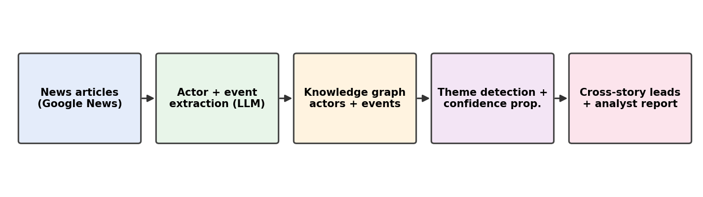
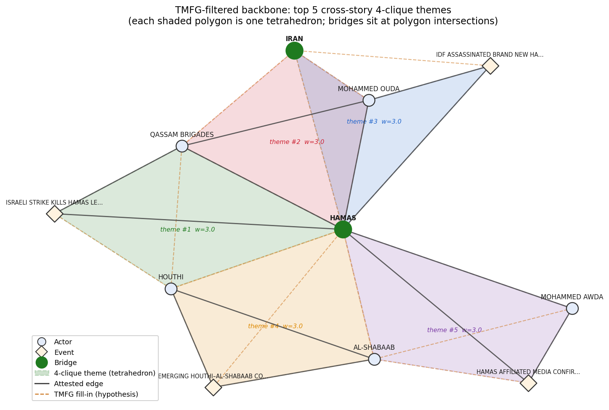
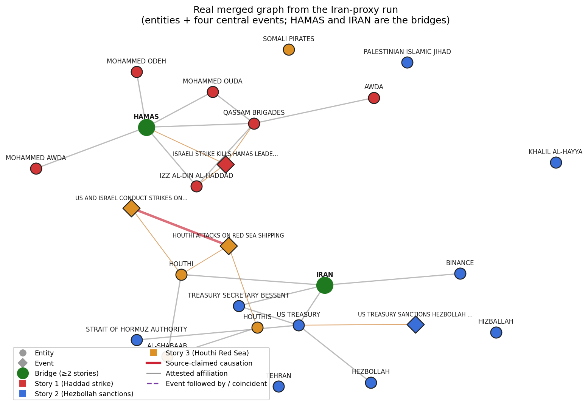
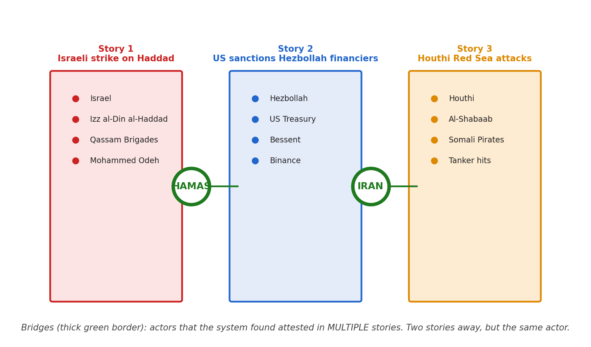
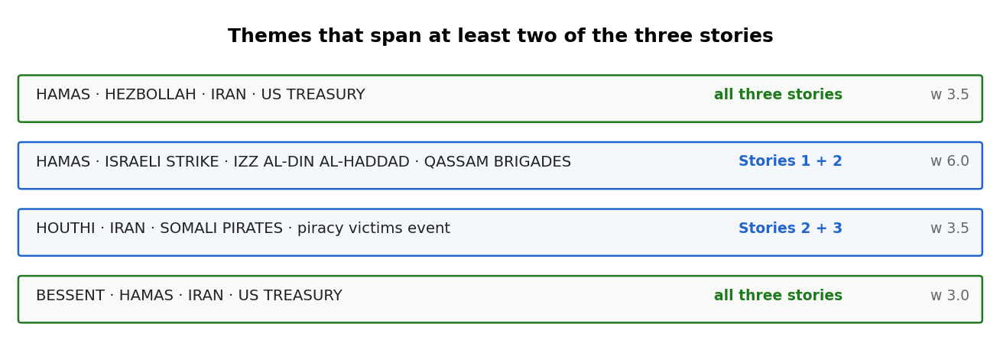
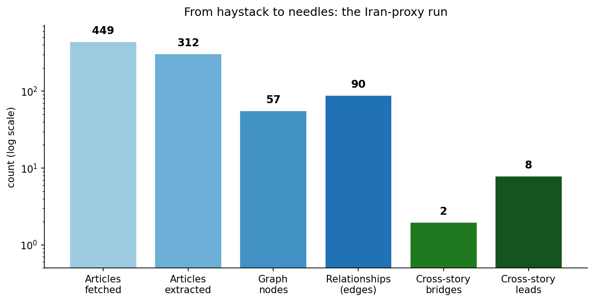
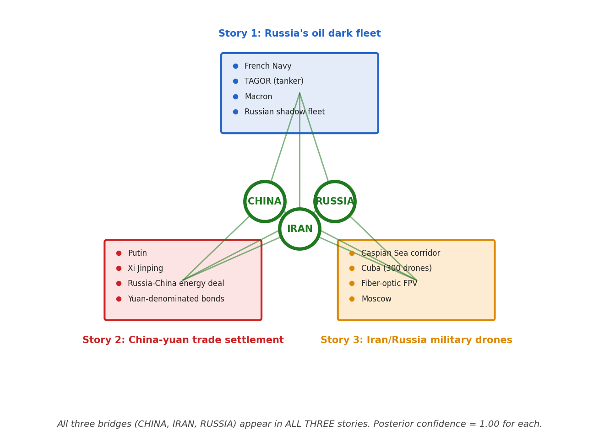

# Finding the Hidden Threads in News

How we built a tool that reads across separate news stories and surfaces
the connections an analyst would otherwise miss.

On **May 16, 2026**, Israeli forces killed Hamas military chief Izz
al-Din al-Haddad in a Gaza airstrike. Three days later, the **US
Treasury** sanctioned a group of Hezbollah financiers. That same week,
**Houthi** fighters launched a wave of attacks on Red Sea shipping.
Three stories. Three different beats. Same week.

Are they connected? The short answer is yes — through Iran. But you'd
have to read perhaps a hundred articles to know that with confidence.
And by then, the next batch of news has already broken.

We built a tool that does this reading-across-stories work
automatically. This post is about what it found in our Iran-proxy run,
and how.

## The problem

Open-source intelligence (OSINT) starts with news. An analyst tracking,
say, terror financing reads articles all day — but the stories arrive
*separately*. A military strike here, a sanctions action there, an
attack on shipping somewhere else. The most valuable insight, often,
isn't in any single story. It's in the pattern *across* them.

Two real problems make this hard:

1.  **Volume**: there are too many articles to read everything that
    might be relevant.
2.  **Connection-finding**: even if you read them all, noticing that the
    same actor appears in three apparently-unrelated stories — and
    tracing the why — is mostly manual.

We wanted a system that could take 2–3 narrowly defined queries — the
kind of question an analyst types into a news search — pull dozens of
articles per query, extract the named actors and events from each
article, build a graph of how everything relates, and then find the
*bridges*: the actors that appear across stories.

## How it works

The pipeline at a glance. The plumbing is steps 1–3; the analytical
engine is steps 4–6.

The pipeline runs in six stages. The first two are extraction. The next
three — *merge, filter, triangulate* — turn a soup of per-article facts
into a structured network where the cross-story backbone becomes
visible. The last step lets a downstream confidence calculation
propagate exactly across that network.

1.  **Fetch**. We search Google News for each query and download the
    30–50 most relevant articles.
2.  **Extract**. A large language model reads each article and pulls
    out (a) the **named actors** — people, organisations, countries —
    and (b) the **events** — concrete real-world incidents being
    described: who did what to whom, when, where.
3.  **Merge evidence across articles.** Article \#4 calls them “Vladimir
    Putin”, article \#11 calls them “Putin”, article \#23 calls them
    “the Russian president”. We collapse surface variants of the same
    actor into a *single node*, and the union of articles that mention
    them becomes that node's *evidence list*. Same for relationships: if
    three articles all say “Hamas is part of Iran's network”, that's one
    edge whose *weight* is three and whose *source list* is the three
    URLs. Evidence merging is the step that turns a soup of per-article
    extractions into a single network you can reason over.
4.  **Filter to the structural backbone.** A news corpus produces many
    weakly-attested edges — one article alone might mention a tangential
    connection. We rank edges by how many distinct articles attest them
    and drop the singletons. To make sure no relevant actor gets cut off
    from the investigation subject, the algorithm walks the *shortest
    path* from any orphaned actor back to the root and restores the
    minimum set of edges needed to keep them reachable. The output is a
    sparser graph in which every edge is either independently
    corroborated or earned its keep as part of a path. *(This is a
    corroboration-weighted variant of information-filtering networks.)*
5.  **Triangulate — the theme detector.** The next step builds a
    chordal-planar triangulation called a **TMFG** (Triangulated
    Maximally Filtered Graph). Greedily, the algorithm picks the four
    most-connected actors as a starting tetrahedron, then iteratively
    glues new actors onto the open triangular faces, always choosing the
    actor whose three new edges add the most weight to the structure.
    The result is an exactly-planar graph that decomposes into a tree of
    4-cliques. Each 4-clique is a *theme* — four actors whose shared
    evidence is strong enough that they bind together. Some edges TMFG
    adds are between actors who weren't directly attested together in
    any single article; these *fill-in edges* become the system's
    *structural hypotheses* for the analyst to verify.

Real data from the Iran-proxy run: five top cross-story 4-clique themes
shaded as polygons over the TMFG-filtered subgraph. Solid grey edges are
corroborated by at least one source article; dashed orange edges are the
structural *fill-in* the algorithm adds to satisfy chordality — the
system treats those as hypothesis claims the analyst should look at.
**HAMAS** sits at the intersection of four polygons and **IRAN** at two;
that intersection pattern is what makes them structurally cross-story,
not just textually co-occurring.

6.  **Confidence propagation**. Each actor starts with a per-article
    confidence score; we then adjust those scores by what the network
    shows. *If you're consistently surrounded by high-confidence actors,
    your score goes up; if your only neighbours are themselves shaky, it
    goes down.* (Under the hood, this is a junction-tree
    belief-propagation pass over the clique tree the TMFG produced; the
    propagation is exact because the graph is chordal — that is one of
    the practical payoffs of insisting on a chordal triangulation in the
    previous step.)

For **cross-story analysis** we feed all the queries into one session of
the same pipeline. Every actor and every relationship is stamped with
which query produced it. After the pipeline runs, we look for actors
that appear in *more than one* query's data. Those are the bridges — the
structural backbone of any cross-story claim.

## A worked example: Iran's proxy network

We ran the pipeline on three independent news searches from May 2026:

The actual merged graph, rendered from the system's output. Each story
is one colour family; the two green-bordered nodes — **HAMAS** and
**IRAN** — are the bridges. The thick red line on the right is the
source-claimed causation we'll discuss below.

*(The figure shows the merged graph the pipeline actually produced, not
a schematic. Entities are circles, events are diamonds; the four
canonical events surface visually as diamond nodes, hundreds of
finer-grained extractions are hidden for readability.)*

| Story | Query | Articles processed |
|----|----|----|
| 1 | Israeli strike kills Hamas leader Izz al-Din al-Haddad May 2026 | 86 |
| 2 | US Treasury sanctions Hezbollah financiers May 2026 | 112 |
| 3 | Houthi attacks Red Sea shipping May 2026 | 163 |

The three queries cover different theatres — Gaza kinetic, US financial
regulation, Red Sea shipping. No two articles share an explicit topic.
An analyst reading them in sequence would see three distinct stories.

Here is what the system found:

Three independent news stories (red / blue / orange panels). Two actors
emerged as bridges between them — HAMAS connects Stories 1 and 2; IRAN
connects Stories 2 and 3.

Two actors emerged as cross-story bridges:

- **HAMAS** — attested in both Story 1 (the strike on its military
  chief) and Story 2 (the financial sanctions on its alleged backers).
- **IRAN** — attested in both Story 2 (the financial network around
  Hezbollah) and Story 3 (the Houthi shipping attacks).

The system also surfaced themes that span *all three* stories. The top
one:

> **HAMAS · HEZBOLLAH · IRAN · US TREASURY** — a four-actor clique
> present in every story's data, with a structural weight of 3.5 (high).
> This is the Iran-proxy ecosystem in one line: two designated armed
> proxies, the patron state, and the regulator going after the money.

Cross-story themes ranked by structural weight. Themes spanning all
three stories are highlighted in green.

## What an investigator gets out of it

For each bridge, the system produces a small dossier the analyst can
verify:

- The **list of articles** in each story that mention the bridge.
- The **actual quotes** (with URL) the LLM extracted as evidence.
- The **structural reason** the system thought this was a bridge.

For HAMAS:

| Story | Evidence records | Sample source |
|----|----|----|
| Story 1 (Haddad strike) | 51 | pbs.org · themedialine.org · washingtonpost.com |
| Story 2 (Hezbollah sanctions) | 15 | pbs.org · washingtonpost.com · jpost.com |

For IRAN:

| Story | Evidence records | Sample source |
|----|----|----|
| Story 2 (Hezbollah sanctions) | 6 | newsmax.com · wfmd.com (Iran's proxy war article) |
| Story 3 (Houthi Red Sea) | 5 | theatlantic.com · shafaq.com |

### The lead that earned its keep

The system ranked the following cross-story lead in its top eight. The
connection isn't directly attested in any single article — but it is
grounded in source-cited edges that route through the IRAN bridge.

**BINANCE** (in Story 2 — Hezbollah financial sanctions)  ↔  **HOUTHI**
(in Story 3 — Red Sea attacks)  *via bridge*  **IRAN**

Backed by an LLM-extracted relation on the Binance node, citing
*Newsmax* citing *the Wall Street Journal*:

> “Iran funneled \$850 million through Binance ... Binance was used as a
> channel for Iranian financial transactions.”  
> newsmax.com

That's a defensible analyst lead — not “Binance is helping the Houthis”
(no article says that), but “Iran's financial channels through Binance
overlap with the same Iran that operates the Houthis. Worth examining
together.”

## Reading a theme: a corroborated sub-network, not just a cluster

A theme is the system's answer to “which actors belong together?” — a
tight group of four that keep co-occurring across the corpus. Early on,
themes were ranked purely by how *densely* the four were connected. That
had a blind spot: four actors linked by a handful of single,
low-confidence mentions scored the same as four bound by six
independently-corroborated relationships. Density isn't evidence.

So we changed how themes are weighted. A theme's rank now reflects the
**strength of the evidence** behind its internal relationships: attested
actor-to-actor links count for more than incidental co-mentions, and a
link corroborated across several independent stories counts for more
than one seen once. The practical effect — the theme at the top of the
list is the best-*evidenced* cross-story structure, not merely the
busiest one. On a real three-story run, this flipped the top-ranked
themes from a roughly even actor/event mix to about **90%
actor-centred**, surfacing the relationship structures an investigator
wants and pushing duplicate event-headlines down the list.

And a theme is no longer a dead-end label. Open one and it expands into
the **relationships that bind its members**, each with the source that
attests it. Take the top theme from the Hamas-strike story:

### Theme: Hamas · Qassam Brigades · Izz al-Din al-Haddad · the strike

Four names that co-occur — but opened up, a sourced command structure:

- **Hamas** → **Qassam Brigades** *(affiliation)*: “The Qassam Brigades
  are the military wing of Hamas.”
  pbs.org
- **Izz al-Din al-Haddad** → **Qassam Brigades** *(leadership)*: “Izz
  al-Din al-Haddad was the leader of the Qassam Brigades, Hamas'
  military wing.” aljazeera.com
- **Hamas** → **Izz al-Din al-Haddad** *(leadership)*: “...identified as
  the leader of the Hamas military wing at the time.”
  AP · Jerusalem Post · Ynet

The investigator doesn't take “these four are related” on faith. They
read the corroborated structure — who leads what, attested by whom —
without leaving the theme. A theme that survives that read is a finding;
one that doesn't is quietly discarded. Where the system links two
members it only *inferred* structurally (no single article states it),
it says so, so an analyst never mistakes a hypothesis for an attested
fact.

## Going further: source-claimed causation

Bridges tell us that two stories share an actor. They do *not* tell us
that one story caused another. For the causal layer we ran a third
extraction pass on every chunk: an LLM signature that captures **causal
assertions the source itself makes** — language like “in response to”,
“triggered by”, “in retaliation for”.

This is grounded in two things. First, a survey of causal-discovery
methods (Zanga et al., 2023) is emphatic that observational data alone
yields only Level-1 evidence on Pearl's ladder of causation —
association, not cause. Second, news articles routinely *make* causal
claims, which is a different thing from *establishing* them. We capture
those claims as a structured field the analyst can verify.

Each extracted claim gets four numbers:

- **strength**: how explicit the claim is in the article (“caused” =
  0.9, “likely triggered” = 0.5, “some observers speculate” = 0.3).
- **confidence**: how confident the LLM is in the extraction.
- **attestation count**: how many distinct sources make the same claim.
- **weight**: `strength × confidence × multi-source boost`, where the
  boost goes from 1.0 (single source) up to 2.0 (5+ sources). One hedged
  claim from one publisher is well under 1.0; an explicit claim
  corroborated by half a dozen sources lands above it.

### What this layer found in the Iran-proxy run

Out of 2 causal-claim edges that survived resolution, the strongest one
is the kind of finding an analyst would write up:

> **HOUTHI ATTACKS ON RED SEA SHIPPING**  →  **US AND ISRAEL CONDUCT
> STRIKES ON HOUTHI MILITARY SITES**  
>   
> *Weight 1.71 (STRONG). Strength 0.90, confidence 0.95, attested by 6
> independent sources. Direction tags: “triggers” and “responds_to”.*  
>   
> Paraphrase across sources: “US and Israel conducted strikes on two
> strategic Houthi military sites in response to Houthi attacks on Red
> Sea shipping.”  
> arabcenterdc.org
> britannica.com
> wfmd.com +3
> more

The Hamas-strike and Hezbollah-sanctions stories produced **zero**
causal-claim edges. Their articles describe what happened in temporal
sequence but rarely use explicit causal language between named entities
— which is exactly the kind of restraint we wanted the prompt to
enforce. The system says “I don't see explicit causation here” rather
than inventing it.

*Trade-off worth naming: this third extraction pass adds about 30–40% to
LLM cost per chunk. Two strong claims from a 56-minute run is a thin
yield. Worth keeping on for cross-story investigations where the “why
did this happen?” question matters; worth gating off for general
entity-mapping runs where it doesn't.*

## The numbers

From a haystack of articles to a small set of actionable leads, on a log
scale.

The funnel for the Iran-proxy run:

- 449 articles fetched across the three
  queries.
- 312 articles successfully extracted (the
  rest were paywalls, dead links, or low-content).
- 57 nodes in the merged graph — 36 events
  plus 21 actors.
- 90 directly attested relationships between
  them, each carrying its source URL.
- 2 cross-story bridge actors.
- 8 ranked cross-story leads worth following
  up.

The end-to-end run took roughly 50 minutes from query to artifact.
Reading 350 articles manually and tracking entity relationships across
them would take a working day at minimum.

## Does it generalise? A second domain

A reasonable question after seeing the Iran-proxy results is whether the
pipeline really does what it claims, or whether the bridges only emerge
because Middle-East news shares a small set of repeating actors. To
check, we kept the code unchanged and pointed it at a completely
different topic: the financial side of **sanctions evasion around the
war in Ukraine**. Three queries:

- "Russia oil sanctions evasion dark fleet" — covers the shadow fleet,
  tanker seizures, and the French + UK navy interdictions.
- "China yuan settlement Russia trade sanctions" — covers the
  de-dollarisation push, RMB-denominated bonds, and bilateral energy
  deals.
- "Iran Russia military cooperation drone supply" — covers the
  drone-component trade, the Caspian corridor, and Cuba's 300-drone
  purchase.

Same code, same orchestrator, no manual tuning — just a different
`--domain` flag (which substitutes a sanctions-focused relevance
hypothesis for the terror-financing one). The pipeline fetched
518 articles, built a 174-node graph, and
surfaced 12 cross-story bridges.

In the Russia / China / Iran case, **three actors bridge ALL three
stories**: CHINA, IRAN, and RUSSIA each appear in every run with
posterior confidence 1.00. Compare with the Iran-proxy network where the
bridges link adjacent pairs of stories. Same pipeline, different
underlying topology.

The bridge topology that emerges is structurally different from the
Iran-proxy case. In the terror-financing run, HAMAS and IRAN each
bridged *two* of the three stories (an asymmetric chain). In the
sanctions-evasion run, three state-level actors all bridge *all three*
stories — signalling that the underlying news network isn't a chain but
a triangle, with the same three powers attested across the oil,
financial, and military narratives. That is itself a finding: the system
tells you not just *who* is shared across stories but also what *shape*
the shared structure takes.

Three things from the run that survived our quality bar:

- A weight-6.0 cross-story theme grouping CHINA, IRAN, and the events
  *"China supplies drone parts to Iran and Russia despite US sanctions"*
  and *"China launches oil-for-gold and silver settlement strategy"* —
  that is, the analyst is told that the same actor set sits at the
  centre of both the financial workaround and the kinetic supply chain.
- BINANCE re-surfaces as a cross-story actor (already a bridge in the
  Iran-proxy run via the \$850M Iran-conduit story; here it appears
  again in the sanctions-evasion context).
- Two near-duplicate surface forms that earlier slipped through —
  PUTIN + VLADIMIR PUTIN, and HORMUZ + STRAIT OF HORMUZ — now collapse
  correctly into single bridge actors. (Mentioned because the “*same
  actor written two ways*” problem is one analysts will recognise; it
  took an explicit alias rule to fix.)

A single second-domain test isn't proof of broad portability. But it
does rule out the worst-case story — that we tuned the system to one
news narrative until it worked. The same code, fed a topic with no
overlap in actors or vocabulary, produces the same kind of output:
bridges, themes, and source-cited leads.

## A finding about our own pipeline: read the article, not just the headline

The sharpest finding this month was about the system itself. We wanted
to push it past the newswire and onto a *single document* — the kind of
case file an investigator actually receives. So we took a publicly
released, anonymised UK police report of a GBH stabbing, built a
fictionalised copy with an invented cast (no real people), and fed that
one PDF in. The result was almost nothing: a graph with
one node. A dense, name-rich incident report
had produced an empty network.

The dig was more interesting than the bug. Entity extraction had been
running on article **titles and metadata only** — the article *body* was
being silently discarded before the language model ever saw it, a
leftover from the system's origins processing structured data feeds
rather than free text. With a normal news run this hides in plain sight:
fifty headlines still carry enough names to make the graph look healthy.
With a single document there is exactly one headline, so the whole thing
collapses — which is precisely what exposed it.

Feeding the body to the extractor changed the picture completely. On a
single GNews query we A/B-tested the same run with and without article
bodies:

- Title-only: 9 actors,
  70 nodes.
- Body-included: 184 actors,
  635 nodes — a **20×** gain in named
  actors, on identical queries and parameters.

And it wasn't just more of the same. The body surfaced named actors no
headline ever carried — an Iranian foreign minister, the Al-Qassam
Brigades, a sanctioned ethical bank, heads of state — the specific “how”
of a network that titles only gesture at. The headline is a lossy
summary; the relationships live in the body.

### The bug that was costing 20× the signal

A single legacy line — dropping the `text` field before extraction —
meant every investigation, for the system's whole life, had been reading
headlines and ignoring the articles underneath. News runs masked it
through sheer volume of headlines. It took the single-document stress
test to make the loss visible. Fixing it turned the empty crime-report
graph into a full case network: 58 nodes —
the three suspects (the prime suspect ranked highest), both victims, the
witness who placed a fingerprint, the intervening manager, and the
investigating officers — with the who-did-what-to-whom roles attested:
*Marsh — perpetrator*, *Ferris — victim*, *Anand — intervenor*.

Two smaller findings rode along. First, the *question you ask* decides
who survives: an early phrasing of the criminal-investigation prompt
scored entities for *culpability*, which quietly dropped the victims and
witnesses (they commit no crime) and kept only suspects. Re-framing it
as an *involvement* test — party to the incident in any role — brought
the full cast back. Second, the same incident was being extracted as
21 near-duplicate “events” (one per
paraphrase: *“stabbing at the hotel”*, *“GBH outside the hotel”*…).
Matching events by an embedding-similarity on their names — not just
exact strings — collapses those paraphrases back into the single
incident they describe.

## Beyond Google News: more ways in

The early system had exactly one way to gather material: a Google News
search. That is a narrow mouth for an OSINT tool — newswires miss
encyclopedic background, sanctions designations, and the document an
analyst was actually handed. So the fetch step grew a set of pluggable
**search sources**, each toggled per-investigation, each flowing through
the *identical* extract → graph pipeline. A source that isn't configured
or fails is simply skipped; it never breaks a run.

| Source | Key needed | What it adds |
|----|----|----|
| **Wikipedia** | no | Encyclopedic background on the subject. |
| **GDELT** | no | Global news coverage, broader than Google News. |
| **OpenSanctions** | yes | Sanctions / PEP / watchlist entries. |
| **Web search** | no | Generic web results (Programmable Search or DuckDuckGo). |

Two additions matter more than the table suggests. First, you can bring
**your own documents** — upload PDFs or paste URLs — and they are
analysed alongside the news fetch, or *on their own*: point the same
graph machinery at a single case file with the news fetch turned off.
(That single-document path is exactly what surfaced the
read-the-body-not-the-headline bug above.)

Second, after a run the system can **enrich** the top company entities
against external registries: **SEC EDGAR** (US filers, no key) and
**OpenRegistry** (30 national company registries — beneficial owners,
officers, shareholders). An extracted `ORG` like a shell company stops
being just a name in a sentence and gains its real corporate record,
attached to the node and cited in the report.

## A memory across investigations: the cumulative knowledge base

Each run, on its own, is amnesiac — it sees only the articles fetched for
*its* queries. But an analyst working a beat runs the system again and
again, and the valuable context is cumulative: *we have seen this actor
before, in a different investigation, doing a different thing.* So every
finished investigation's graph now folds into **one persistent knowledge
graph** that later runs draw on and that you can query directly from a
**Knowledge Base** tab.

It is built in-code on **LightRAG** (no separate server) and merges by
canonical entity name — so the same real-world actor accumulates evidence
across runs rather than fragmenting into one node per investigation. The
canonicalizer is deliberately **conservative**: it auto-merges only exact
and normalized matches (`U.S.` ↔ `US`), and writes the genuinely
ambiguous pairs (`JAMES COMER` vs `JAMES COMEY` — one letter, two people)
to a review log rather than guessing. Cross-investigation merges are
sticky and hard to undo; better to under-merge than to silently fuse two
people.

### What the schema drops, a sidecar keeps

LightRAG stores a fixed shape — per node, just `name / type /
description / source`. Everything else our pipeline computes (belief
scores, the full evidence list, identifiers, aliases, the
belief-propagation *impact shift*) would be lost on merge. So a
**structured sidecar**, keyed by the same canonical names, preserves and
merges all of it across investigations. The knowledge base answers a
question over *everything ever seen*, and each entity comes back joined
to its complete cross-investigation record — not just the one run that
happened to be open.

A subtlety that shaped the design: the in-code merge feeds LightRAG a
*pre-built graph*, not article text, so the store has **no text chunks**
to retrieve on. Retrieval and synthesis see only the **description
text**. So we fold the high-signal facts — role, location, identifiers,
aliases, and the dated timeline — *into* that description. That is what
lets the knowledge base actually use the structure it stores, rather than
just display it.

## Putting time back in: the temporal layer

The pipeline always extracted event dates, but the cumulative merge threw
them away — the global graph knew *who* connected to whom and forgot
*when*. We rebuilt the merge to carry a **temporal layer** through:
per-entity **timelines** (the dated events an actor was part of, assembled
into one chronology with a first/last-seen range) and the **event→event
ordering edges** (this event followed that one; these two coincided).

The payoff shows up in retrieval. Because the dated timeline is folded
into each entity's embedded description, the knowledge base can answer
questions *by time* without the asker naming the entity:

### Retrieval by timeline

> **Q:** *"Which organization was banned by Germany in 2024?"*  
> **Q:** *"What entity was subject to an OFAC action in October 2024?"*

Both return **Samidoun** — correctly, and *without the query mentioning
it* — because its embedded timeline carries the dated German ban and the
dated US Treasury designation. After re-ingesting the accumulated store,
the temporal layer held **1,239 dated events**, **901 event-ordering
edges**, and **824 entities with assembled timelines**. The graph
remembers not just the network, but its history.

## The key network: a whole investigation in one skeleton

Themes and bridges each answer a local question. The remaining gap was a
*global* one: show me, in one view, the connective tissue of the entire
investigation. Two features close it.

**Connections** lets an analyst pick any set of actors and ask how they
interconnect — not just the direct edge, but the **hidden** multi-hop
chains (up to *k* shortest simple paths per pair), surfaced *even when a
direct link already exists*. The intermediary nodes are ranked by
betweenness and the central ones flagged as **brokers** — the entities
that actually bind the selection together.

> Select **Arnon Milchan** and **Shaul Elovitch** in a Netanyahu run.
> The shortest path is the obvious `Milchan → Netanyahu → Elovitch`. But
> *hidden* mode also surfaces `… → Bezeq → Elovitch` and `… → Walla!
> News → Elovitch` — the Case-4000 entities — and flags **Netanyahu** as
> the broker.

The **Key network** tab is the automatic version: same hidden-path
machinery, but seeded with the investigation's most relevant nodes (theme
members ∪ cross-story bridges, no manual selection) and run to surface the
brokers that stitch the otherwise-isolated themes into a single skeleton.

### One broker holding it together

On a real Netanyahu run, 21 theme nodes resolve through the key-network
algorithm to a **single broker** — the **Attorney-General's Office** —
the entity binding the otherwise-separate clusters into one structure.
That is the kind of finding the themes view alone never shows: not which
actors group together, but the one node the whole investigation hinges
on.

## What this is NOT

We're careful about claim language. The system surfaces structural
co-occurrence and source-attested relationships. It does NOT claim:

- **Causation.** “Iran bridges Hezbollah and Houthis” means the same
  Iran is attested in both stories — not that Iran *caused* the Houthi
  attacks. Cause-and-effect language belongs to the analyst reading the
  source articles, not to the graph.
- **Comprehensiveness.** The graph is only as good as the news corpus.
  If the only coverage is from one publisher, the graph leans that way.
  The analyst should still triangulate against other sources.
- **Final answers.** A cross-story lead is a place to start reading, not
  a conclusion. The system gives you the URLs precisely because someone
  still has to read them.

## What's next

The current system surfaces *who-is-connected-to-whom-across-stories*
well, and now remembers across investigations (the cumulative knowledge
base), carries time through that memory (the temporal layer), and lets an
analyst pull a whole investigation's skeleton in one view (the key
network). The obvious next gaps:

- **From timeline to causation.** The temporal layer now tells us that
  Event A happened before Event B and that they share actors. We still
  don't ask the harder question — did A *cause* B? — in a defensible way.
  Ordering is necessary for causation but not sufficient.
- **Monitoring and impact.** With a persistent graph and per-entity
  timelines in place, the natural next step is a scheduled sweep that
  takes the day's top news, extracts its events and actors, intersects
  them with the global graph, and propagates the **impact** onto
  connected nodes — pushing cross-story leads as they emerge rather than
  waiting for a manual run. The temporal layer and the belief-propagation
  *impact shift* the sidecar already records are exactly what that needs.
- **Tighter event extraction.** The LLM occasionally extracts a news
  headline as if it were an actor (“FRANCE INTERCEPTS RUSSIAN TANKER…”
  classified as an entity rather than as a description of an event). Two
  recent passes help: a post-extraction validator rewrites such records
  when a shorter noun-phrase label is available, and the Stage-2 query
  picker now refuses to expand on headline-shaped or event-typed
  identifiers. Some still slip through when the LLM produces no shorter
  alternative — the remaining cases are visible but bounded. Event
  *paraphrases* of one incident now merge by embedding similarity on the
  event name (not just exact match), so a single document no longer
  shatters into a dozen near-duplicate events.
- **Streaming.** The system runs on demand. The obvious extension is a
  weekly/daily sweep over an analyst's watchlist of queries — pushing
  cross-story leads as they emerge rather than waiting for a manual run.

------------------------------------------------------------------------

**Takeaway.** The point isn't replacing the analyst's judgement. It's
compressing the “read 300 articles to notice the one cross-story link”
step into something an analyst can verify in minutes. The system tells
the investigator *where to read*; reading, judging, and writing the
report stays human.

This post draws on a real pipeline run from May–June 2026, fetching news
via the public GNews aggregator. All quoted evidence is sourced to
actual articles cited in the merged-graph data. No proprietary data, no
human intelligence, no closed sources. The pipeline is research-grade
software; the analyst-report generator is a Python script. Numbers in
this post are exact counts from one specific run; different runs on the
same queries may differ slightly due to LLM non-determinism and
news-corpus drift.

