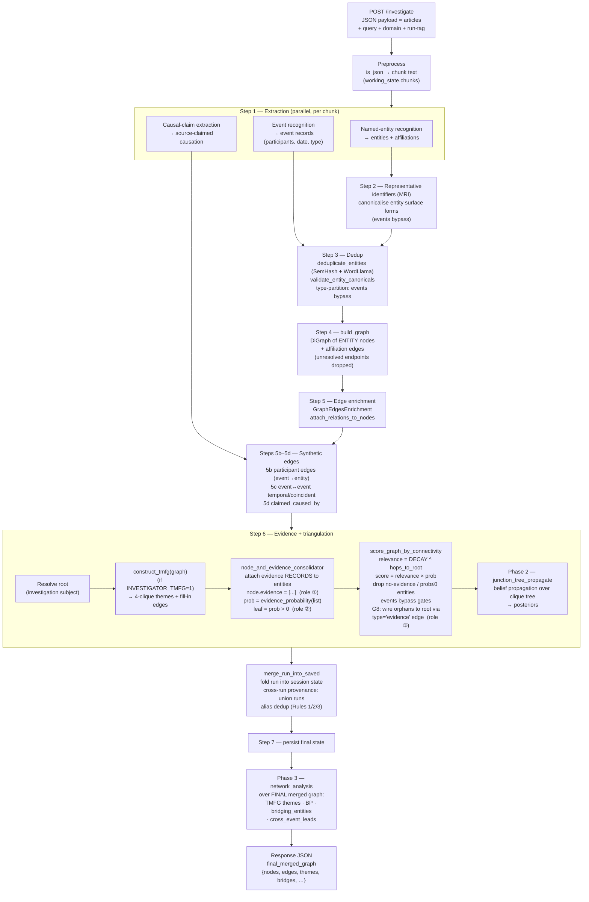

# Graph-creation flow (the pipeline)

> Traces the per-investigation engine pipeline (current). For what happens to the
> graph *after* a run — accumulation into the cumulative KG — see
> [knowledge-base.md](knowledge-base.md); for interactive analysis on top of it,
> [analysis.md](analysis.md).

How one POST of source material becomes a scored, network-analysed graph.
Traced from `src/investigator/pipeline/orchestrator.py::_standard_pipeline`
(steps 1–7) plus the Phase 1–3 network-analysis stages and the
cross-run merge.

> Terminology note: the word **evidence** appears in three unrelated roles
> in the code. They are flagged inline below and summarised at the end.

---

## 1. The single-run pipeline (one POST)



### Step-by-step

| Step | Function | In → Out |
|---|---|---|
| Preprocess | `preprocess_text` | raw JSON → chunked `working_state` |
| 1. Extract | `named_entities_extractor_task`, `EventsRecognition`, `CausalClaimsExtraction` | chunks → entity records, affiliations, event records, causal claims |
| 2. MRI | `MostRepresentativeIdentifier` | surface forms → canonical entity ids (events skip) |
| 3. Dedup | `deduplicate_entities`, `validate_entity_canonicals` | merge duplicate entities; rewrite headline-shaped ids; events bypass |
| 4. Build | `build_graph` | entity records + affiliations → **DiGraph of entities + affiliation edges** |
| 5. Enrich | `GraphEdgesEnrichment`, `attach_relations_to_nodes` | edges gain relation type + context; relations copied onto nodes |
| 5b–5d | `participant edges`, `infer_event_temporal_edges`, `_synthesise_causal_claim_edges` | events wired to participants; event↔event temporal edges; `claimed_caused_by` edges |
| 6. Evidence + triangulate | `construct_tmfg`, `node_and_evidence_consolidator`, `score_graph_by_connectivity`, `junction_tree_propagate` | attach evidence, score survival, keep root-connected, propagate beliefs |
| Merge | `merge_run_into_saved` | this run ∪ accumulated session graph |
| 7. Persist | `InvestigationState.save` | write final state |
| Phase 3 | `network_analysis` | merged graph → themes, bridges, cross-event leads |

---

## 2. What survives into the graph

The **graph vertices are only ENTITIES and EVENTS.** Evidence is *not* a
vertex — it is data attached to entity nodes. The edge set is:

```
affiliation          attested entity↔entity relation (from extraction)
participates_in      event → participant entity            (Step 5b)
event_followed_by    event → event, temporal               (Step 5c)
event_coincident     event ↔ event, same window            (Step 5c)
claimed_caused_by    source-asserted causation             (Step 5d)
evidence             SYNTHETIC root-wiring (role ③)         (Step 6 G8)
```

Survival rule (entities): a node survives only if it has **credible
evidence** (`prob > 0`). Events bypass this — their survival is decided by
the Event NER, and they are wired to root by the G8 evidence edge so they
stay reachable.

---

## 3. The three roles of "evidence"

| Role | What it is | Lives as | Load-bearing? |
|---|---|---|---|
| ① Evidence **records** | source quotes + reasoning + strength/confidence/polarity | a **list on each entity** (`node["evidence"]`) | **Yes** — `prob = evidence_probability(list)` |
| ② `leaf` flag | "this entity has credible evidence" (`prob > 0`) | boolean on the node | Mostly viz colouring; gates use `prob` |
| ③ `evidence`-type **edge** | synthetic wiring so every survivor reaches the root | a graph **edge** (G8 in `score_graph_by_connectivity`) | **Yes** — keeps the graph connected |

These three share a name but are different mechanisms. Role ③ in
particular is *not* evidence in the analytic sense — it is triangulation
connectivity, and the UI renders it as the faint "backbone" edges.

---

## 4. Cross-run (multi-query) overlay

A cross-event investigation POSTs each query into the **same session_id**
with a different `run` tag. Each run executes the full single-run
pipeline above, then `merge_run_into_saved` folds it into the accumulating
graph:

```
run A ─┐
run B ─┼─► same session_id ─► merge_run_into_saved ─► one merged graph
run C ─┘                          │
                                  ├─ every node/edge stamped with `runs[]`
                                  ├─ alias dedup (Rules 1/2/3)
                                  └─ Phase 3 derives:
                                       bridging_entities  (in ≥ 2 runs)
                                       cross_event_themes (4-cliques spanning runs)
                                       cross_event_leads  (triangle via shared bridge)
```

`bridging_entities` are the structural backbone of any cross-story claim:
an entity attested in two or more independent runs.

---

## 5. ASCII quick-reference (terminal-friendly)

```
POST(JSON articles, query, domain, run)
        │
        ▼
  preprocess → chunks
        │
        ▼
  [1] extract ── entities ─┐
                events ────┤ (events bypass MRI + dedup)
                causal ────┘
        │
        ▼
  [2] MRI canonicalise (entities only)
        │
        ▼
  [3] dedup + canonical-validate
        │
        ▼
  [4] build_graph → DiGraph(entities, affiliation edges)
        │
        ▼
  [5] enrich edges + attach relations
  [5b/c/d] participant / temporal / causal edges
        │
        ▼
  [6] resolve root
      ├─ TMFG → themes + fill-in
      ├─ consolidate evidence → node.evidence[], prob, leaf
      ├─ score_graph → relevance×prob, drop weak, G8 root-wire
      └─ junction-tree BP → posteriors
        │
        ▼
  merge_run_into_saved (stamp runs[], alias dedup)
        │
        ▼
  [7] persist
        │
        ▼
  Phase 3 network_analysis → themes, bridges, cross_event_leads
        │
        ▼
  response: final_merged_graph
```
